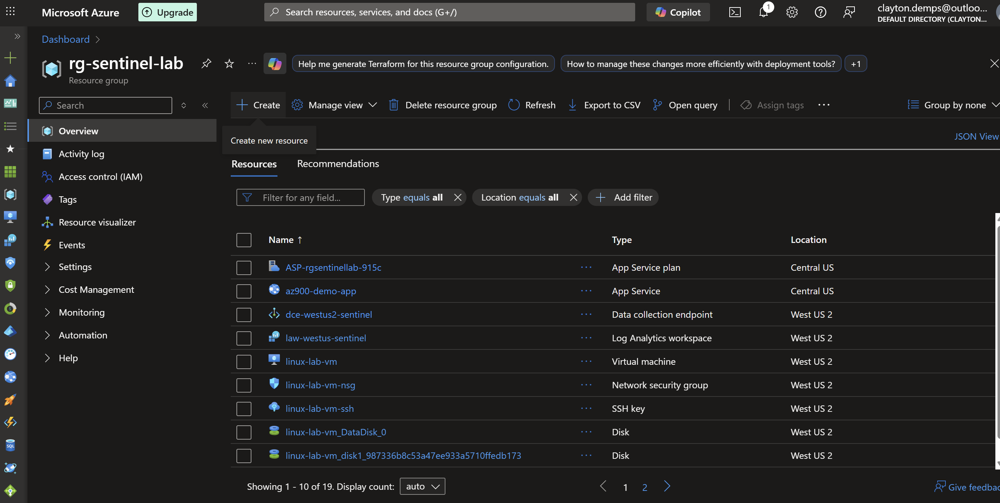
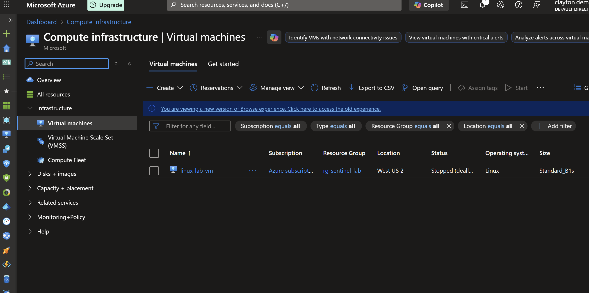
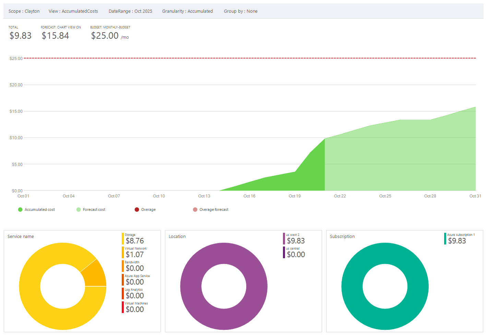

# ☁️ Microsoft Azure Fundamentals (AZ-900)

## Overview
This folder documents my full preparation for the **Microsoft Certified: Azure Fundamentals (AZ-900)** certification.  
It combines Microsoft Learn modules, hands-on Azure labs, and resource deployments inside my real environment:

- **Resource Group:** `rg-sentinel-lab`  
- **Region:** West US 2  
- **Key Resources:** Linux VM (`linux-lab-vm`), App Service (`az900-demo-app`), Log Analytics Workspace (`law-westus-sentinel`)  

---

## Learning Milestones

| # | Milestone | Focus Area | Status |
|:-:|------------|------------|:------:|
| 1 | **Core Azure Fundamentals** | Cloud Concepts, Architecture & Governance | ✅ [View Details](milestone-1-foundations.md) |
| 2 | **Prepare for Azure Administrator (AZ-104 Prereqs)** | Deploy & Manage Compute Resources, Storage, Networking | ⏳ In Progress |
| 3 | **Certification Validation** | Review & Exam Readiness for Microsoft Certified: Azure Fundamentals | 🔜 Pending |

---

## Microsoft Learn Paths Covered

| Learning Path | Modules | Key Topics |
|---------------|----------|------------|
| **Describe Cloud Concepts** | 3 | Cloud models (IaaS/PaaS/SaaS), shared responsibility, scalability & elasticity |
| **Describe Azure Architecture and Services** | 4 | Core Azure services (compute, networking, storage, identity), regions & availability zones |
| **Describe Azure Management and Governance** | 4 | Azure Policy, Resource Manager, Cost Management, Monitoring, RBAC |

---

## Visual Evidence

| Artifact | Screenshot |
|-----------|-------------|
| Azure Resource Group Overview |  |
| Linux VM Overview |  |
| App Service Overview |  |
| Cost Management Blade |  |

---

## Key Concepts Mastered
- Cloud computing principles and deployment models  
- Shared responsibility model in Azure  
- Core Azure architecture: regions, availability zones, resource groups  
- Identity and governance tools (Azure Policy, RBAC, Cost Management)  
- Monitoring and compliance foundations for Defender and Sentinel integration  

---

## Next Up: Milestone 2
**Prepare for Azure Administrator Certification**

- Create and manage compute resources (VMs, containers, scale sets)  
- Configure storage accounts and networks  
- Manage Azure identities and roles  

Documentation to be added in `milestone-2-compute.md`

---

**Status:** AZ-900 Milestone 1 ✅ Complete  
**Next:** Begin Milestone 2 labs and document results here as progress continues.
