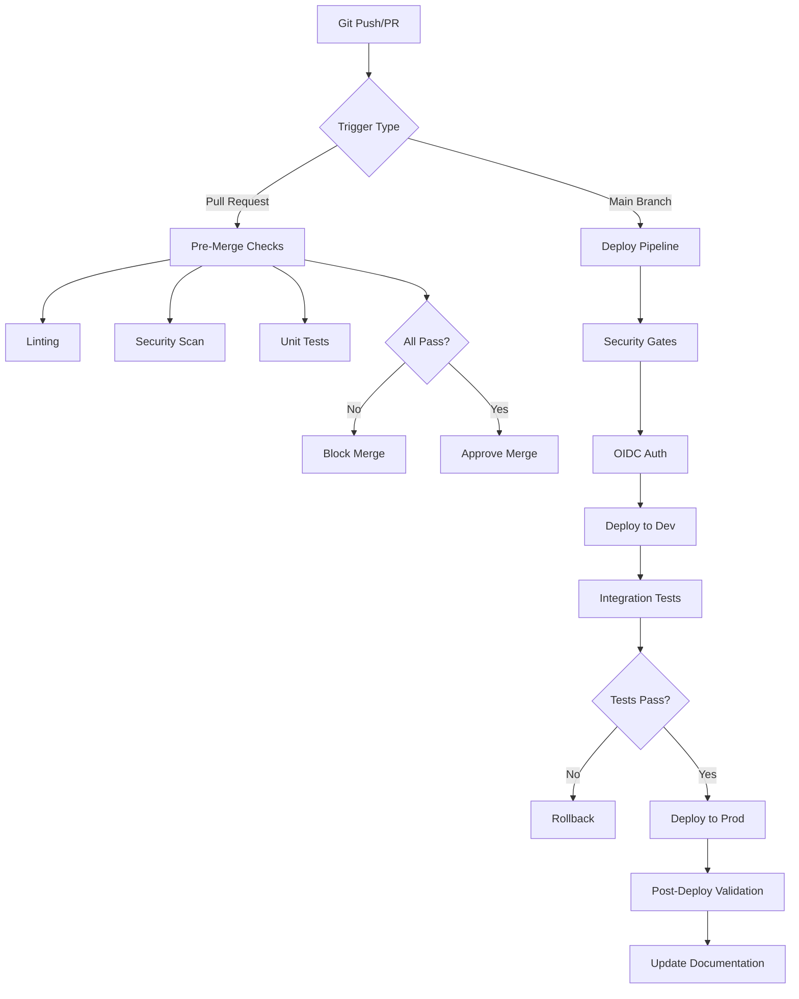
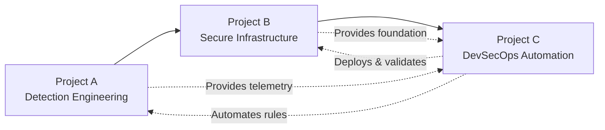

# 📘 Azure Security Portfolio — Project Index

*DevSecOps • Cloud Security Engineering • Threat Detection*

This page serves as a central index for all major projects within my **Azure Cloud Security Portfolio**.  
Each project demonstrates hands-on skills aligned with **Azure Security Engineer (AZ-500)**, **Cybersecurity Architect (SC-100)**, **Security Operations Analyst (SC-200)**, and **real cloud detection engineering** practices.

> 📌 **Navigation**: [Main README](README.md) | [Architecture Docs](docs/architecture/) | [Scripts](scripts/)

---

## 📊 Project Overview

| Project | Focus Area | Skills | Status |
|--------|------------|--------|--------|
| **[Project A](#project-a--cloud-threat-detection-lab)** | Cloud Threat Detection Lab | KQL detections, Sysmon, Sentinel, MITRE ATT&CK | 🟩 Complete |
| **[Project B](#project-b--azure-landing-zone-lite)** | Azure Landing Zone Lite | Secure cloud architecture (IaC: Bicep/Terraform) | 🟩 Complete |
| **[Project C](#project-c--devsecops-pipelines)** | DevSecOps Pipelines | CI/CD security, OIDC, Checkov, tfsec, CodeQL | 🟨 Planned |

**Legend:**
- 🟩 Complete — Fully implemented and documented
- 🟨 In Progress — Active development
- 🟦 Planned — Scoped and ready for implementation

---

## 📁 Project A — Cloud Threat Detection Lab

**📂 Folder:** [`/projects/project-a-cloud-detection-lab`](projects/project-a-cloud-detection-lab/)  
**📚 Documentation:** [`/docs/architecture/ctd-lab-architecture.md`](docs/architecture/ctd-lab-architecture.md)

### Overview

A complete cloud detection engineering environment using:

- **Azure Log Analytics Workspace** — Centralized log aggregation
- **Azure Monitor Agent (AMA)** — Modern telemetry collection
- **Windows Security Event Logs** — Core event monitoring (Event Table)
- **Sysmon** (optional) — Enhanced process and network telemetry
- **KQL-based detections** — Custom analytics for threat hunting
- **MITRE ATT&CK mapping** — Framework-aligned detection coverage
- **Investigation case studies** — Real-world incident response scenarios

### 🔍 Detection Coverage

| MITRE Tactic | Techniques Covered | Detection Count |
|--------------|-------------------|-----------------|
| Credential Access (TA0006) | T1110 - Brute Force | 1 |
| Execution (TA0002) | T1059.001 - PowerShell | 1 |
| Discovery (TA0007) | T1046 - Network Service Discovery | Template |
| Lateral Movement (TA0008) | T1550 - Alternate Auth Material | Template |
| Defense Evasion (TA0005) | T1218 - LOLBAS | Template |
| Persistence (TA0003) | T1543 - Service Creation | Template |
| **Total Active Detections** | | **2 operational, 4 templates** |

### 📖 Key Files & Documentation

| Document | Description | Status |
|----------|-------------|--------|
| **[Lab 01 — RDP Brute Force Detection](projects/project-a-cloud-detection-lab/labs/lab-01-bruteforce-detection.md)** | Complete case study on detecting credential access attacks | ✅ Complete |
| **[Lab 02 — Suspicious Process Creation](projects/project-a-cloud-detection-lab/labs/lab-02-process-creation.md)** | PowerShell downloader/stager detection and investigation | ✅ Complete |
| **[Detection Pack](projects/project-a-cloud-detection-lab/detections.md)** | Comprehensive KQL detection library | 🟨 Expanding |
| **[Architecture Diagram](docs/architecture/ctd-lab-architecture.md)** | Technical architecture and data flow | ✅ Complete |

### 🎯 Lab Scenarios Implemented

#### Lab 01: RDP Brute Force Detection
**MITRE Technique:** T1110 - Brute Force  
**Log Source:** Windows Security Event 4625  
**Status:** Operational Sentinel rule  

**Key Metrics:**
- Threshold: 5+ failed logons in 5 minutes
- LogonType: 3 (Network) or 10 (RDP)
- Severity: High
- Investigation: Full IP attribution, timeline analysis, lateral movement checks

#### Lab 02: Suspicious PowerShell Execution
**MITRE Technique:** T1059.001 - PowerShell  
**Log Source:** Windows Security Event 4688  
**Status:** Operational Sentinel rule  

**Detection Indicators:**
- `Invoke-WebRequest`, `DownloadString`, `DownloadFile`
- `New-Object Net.WebClient`
- `Start-BitsTransfer`, `bitsadmin`
- Base64 encoding, `-EncodedCommand`
- In-memory execution patterns (`IEX`)

### 🛠 Skills Demonstrated

- ✅ Cloud threat detection engineering
- ✅ KQL analytics and query optimization
- ✅ Sysmon + AMA log analysis
- ✅ MITRE ATT&CK framework application
- ✅ Sentinel analytics rule creation
- ✅ Investigation & triage workflows
- ✅ Attack simulation and validation
- ✅ Incident documentation and reporting

### 🔮 Planned Enhancements

- [ ] Additional MITRE-aligned detections (Key Vault, VM Metadata)
- [ ] Behavioral analytics Jupyter Notebook
- [ ] Automated threat hunting queries
- [ ] Sentinel-as-Code export (YAML rules)
- [ ] Integration with SOAR playbooks
- [ ] Custom workbooks for detection coverage

---

## 📁 Project B — Azure Landing Zone Lite

**📂 Folder:** [`/projects/project-b-landing-zone-lite`](projects/project-b-landing-zone-lite/)  
**📚 Documentation:** [`/docs/architecture/lzl-architecture.md`](docs/architecture/lzl-architecture.md)

### Overview

A secure, minimal Azure Landing Zone deployable in a student subscription using **Infrastructure-as-Code**.

This landing zone implements Azure security best practices while remaining cost-effective and suitable for learning environments. It establishes the foundation for running production-like workloads with proper security controls.

### 🏗 Core Components

| Component | Purpose | Security Feature |
|-----------|---------|------------------|
| **Virtual Network** | Network segmentation | Isolated subnets for app/mgmt/logging |
| **Subnets** | Workload isolation | 3 subnets with dedicated NSGs |
| **Azure Bastion** | Secure admin access | Zero public IPs on VMs |
| **NAT Gateway** | Controlled egress | Predictable outbound routing |
| **Network Security Groups** | Traffic filtering | Least-privilege rules |
| **Key Vault** | Secrets management | Centralized credential storage |
| **Log Analytics Workspace** | Centralized logging | Single pane of glass |
| **Data Collection Rules** | Telemetry config | AMA-based log collection |
| **Microsoft Sentinel** | SIEM/SOAR | Threat detection and response |
| **Flow Logs** | Network visibility | Traffic analytics enabled |

### 📐 Network Architecture

**VNet:** `vnet-sec-lz-core` (10.10.0.0/16)

| Subnet | CIDR | Purpose | NSG |
|--------|------|---------|-----|
| `snet-sec-lz-mgmt` | 10.10.1.0/24 | Management hosts | nsg-sec-lz-mgmt |
| `snet-sec-lz-app` | 10.10.2.0/24 | Application workloads | nsg-sec-lz-app |
| `snet-sec-lz-logging` | 10.10.3.0/24 | Security tooling | nsg-sec-lz-logging |

### 📚 Documentation

| Document | Description | Status |
|----------|-------------|--------|
| **[Landing Zone Overview](projects/project-b-landing-zone-lite/landing-zone-lite.md)** | Architecture principles and components | ✅ Complete |
| **[Networking Deep Dive](projects/project-b-landing-zone-lite/networking.md)** | Detailed network configuration | ✅ Complete |
| **[Troubleshooting Guide](projects/project-b-landing-zone-lite/troubleshooting.md)** | Common issues and resolutions | ✅ Complete |
| **[Architecture Diagram](docs/architecture/lzl-architecture.md)** | Visual architecture with Mermaid | ✅ Complete |

### 🔧 IaC Implementations

| Technology | Location | Status |
|------------|----------|--------|
| **Bicep Modules** | [`/infra/bicep/`](infra/bicep/) | 🟦 Planned |
| **Terraform** | [`/infra/terraform/`](infra/terraform/) | 🟦 Planned |

**Planned Modules:**
- Network (VNet, Subnets, NSGs, NAT Gateway)
- Bastion (Secure administrative access)
- Compute (Management VMs with AMA)
- Monitoring (Log Analytics, Sentinel, DCRs)
- Security (Key Vault, diagnostic settings)

### 🛡 Security Features

**Zero Trust Principles:**
- ✅ No public IPs on management VMs
- ✅ Azure Bastion for all administrative access
- ✅ Network segmentation by workload type
- ✅ NSGs with default-deny posture
- ✅ Centralized key management

**Visibility & Monitoring:**
- ✅ Flow logs with Traffic Analytics
- ✅ Activity Log integration
- ✅ Diagnostic settings on all resources
- ✅ AMA-based log collection
- ✅ Microsoft Sentinel enabled

**Compliance Ready:**
- ✅ Audit-ready logging
- ✅ Encryption at rest
- ✅ Network traffic inspection capability
- ✅ Identity-based access controls

### 🛠 Skills Demonstrated

- ✅ Azure network design and implementation
- ✅ Zero Trust architecture patterns
- ✅ Infrastructure-as-Code development (planned)
- ✅ Secure VM deployment strategies
- ✅ Azure Bastion configuration
- ✅ NAT Gateway implementation
- ✅ Log Analytics integration
- ✅ Data Collection Rules (DCRs)
- ✅ Cloud architecture documentation

### 🔮 Planned Enhancements

- [ ] Bicep/Terraform IaC deployment
- [ ] Private endpoints for PaaS services
- [ ] Application Gateway integration
- [ ] Azure Policy implementation
- [ ] Defender for Cloud enablement
- [ ] Automated compliance reporting
- [ ] Multi-region expansion pattern

---

## 📁 Project C — DevSecOps Pipelines

**📂 Folder:** [`/projects/project-c-devsecops-pipelines/`](projects/project-c-devsecops-pipelines/)  
**📊 Status:** 🟨 Planned

### Overview

Security-integrated CI/CD pipelines using GitHub Actions + Azure OIDC for automated, secure infrastructure deployment and validation.

### 🎯 Pipeline Features

**Security Scanning:**
- IaC linting and validation (terraform validate, bicep build)
- IaC security scanning (Checkov / tfsec)
- Static application security testing (CodeQL)
- Secret scanning (GitGuardian, GitHub Secret Scanning)
- Container image scanning (Trivy)
- Dependency vulnerability scanning (Dependabot)

**Deployment Automation:**
- GitHub OIDC → Azure (no stored credentials)
- Automated Bicep/Terraform deployments
- Multi-environment promotion (Dev → Staging → Prod)
- Rollback capabilities
- Drift detection and remediation

**Governance & Compliance:**
- Policy-as-Code enforcement (Azure Policy)
- Compliance scanning and reporting
- Automated documentation generation
- Change tracking and audit logs

### 📋 Planned Pipelines

| Pipeline | Purpose | Security Gates | Status |
|----------|---------|----------------|--------|
| **IaC Validation** | Lint and validate infrastructure code | tfsec, Checkov, Trivy | 🟦 Planned |
| **Security Scan** | SAST, secret scanning, dependency checks | CodeQL, GitGuardian | 🟦 Planned |
| **Infrastructure Deploy** | Deploy Landing Zone Lite | Policy validation, compliance check | 🟦 Planned |
| **Sentinel Deploy** | Deploy analytics rules and workbooks | Rule validation, KQL syntax check | 🟦 Planned |
| **Drift Detection** | Detect and report configuration drift | Policy compliance, resource inventory | 🟦 Planned |

### 🔧 Technology Stack

**CI/CD Platform:**
- GitHub Actions (primary)
- Azure DevOps (alternative consideration)

**Security Tools:**
- Checkov (IaC scanning)
- tfsec (Terraform security)
- CodeQL (SAST)
- Trivy (container/IaC scanning)
- GitGuardian (secret detection)

**IaC Tools:**
- Bicep (primary for Azure)
- Terraform (alternative/comparison)

**Authentication:**
- GitHub OIDC → Azure
- Workload Identity Federation
- No stored secrets or service principals

### 📊 Pipeline Architecture (Planned)

### 🛠 Skills to be Demonstrated

- [ ] CI/CD pipeline design and implementation
- [ ] Security gates and quality controls
- [ ] Infrastructure-as-Code automation
- [ ] GitHub Actions workflows
- [ ] OIDC authentication patterns
- [ ] Policy-as-Code enforcement
- [ ] Automated security scanning
- [ ] Deployment validation and testing
- [ ] GitOps principles

### 📝 Documentation (Planned)

| Document | Description | Status |
|----------|-------------|--------|
| **Pipeline Architecture** | End-to-end pipeline design | 🟦 Planned |
| **Security Gates Guide** | How security checks are enforced | 🟦 Planned |
| **OIDC Setup Guide** | GitHub to Azure authentication | 🟦 Planned |
| **Deployment Runbook** | Step-by-step deployment process | 🟦 Planned |

### 🔮 Future Enhancements

- [ ] Drift detection & compliance pipeline
- [ ] Azure Policy-as-Code
- [ ] Automated workbook deployment
- [ ] Logic App playbook automation
- [ ] Multi-region deployment
- [ ] Blue-green deployment strategy
- [ ] Automated rollback triggers

---

## 🎓 Learning Path

This portfolio follows a progressive learning journey:

**Skill Progression:**
1. **Project A** — Understand what to detect and how to respond
2. **Project B** — Build secure foundations that support detection
3. **Project C** — Automate deployment and validation of both

---

## 📈 Portfolio Metrics

### Current Status

| Metric | Count |
|--------|-------|
| Completed Projects | 2/3 |
| Active Detections | 2 operational + 4 templates |
| Documentation Pages | 13 |
| Architecture Diagrams | 2 |
| Scripts | 2 |
| Lab Case Studies | 2 |

### Certification Alignment

| Certification | Coverage | Projects |
|--------------|----------|----------|
| **SC-200** (Security Operations) | 85% | Projects A, B |
| **AZ-500** (Security Engineer) | 70% | Projects B, C |
| **SC-100** (Cybersecurity Architect) | 60% | Projects B, C |

---

## 🔄 Project Roadmap

### Current Focus (Q4 2024)
- [x] Complete Project A detection lab
- [x] Document Project A case studies
- [x] Complete Project B infrastructure
- [x] Document Project B architecture

### Next Steps (Q1 2025)
- [ ] Develop Project C pipeline architecture
- [ ] Implement IaC modules (Bicep)
- [ ] Create CI/CD workflows
- [ ] Add additional Project A detections
- [ ] Implement Policy-as-Code

### Future Vision (Q2 2025+)
- [ ] Multi-region architecture
- [ ] Advanced SOAR playbooks
- [ ] ML-based anomaly detection
- [ ] Compliance automation
- [ ] Public speaking/blog series

---

## 📚 Related Documentation

### Architecture
- [Cloud Detection Lab Architecture](docs/architecture/ctd-lab-architecture.md) — Technical design for Project A
- [Landing Zone Lite Architecture](docs/architecture/lzl-architecture.md) — Technical design for Project B

### Implementation Guides
- [Lab 01: RDP Brute Force](projects/project-a-cloud-detection-lab/labs/lab-01-bruteforce-detection.md)
- [Lab 02: Process Creation](projects/project-a-cloud-detection-lab/labs/lab-02-process-creation.md)
- [Detection Pack](projects/project-a-cloud-detection-lab/detections.md)
- [Landing Zone Overview](projects/project-b-landing-zone-lite/landing-zone-lite.md)
- [Networking Guide](projects/project-b-landing-zone-lite/networking.md)
- [Troubleshooting](projects/project-b-landing-zone-lite/troubleshooting.md)

### Scripts & Automation
- [AMA Installation Script](scripts/install-ama.ps1)
- [Sysmon Installation Script](scripts/install-sysmon.ps1)

---

## 💡 Key Takeaways

This portfolio demonstrates:

1. **End-to-End Security Engineering** — From detection to infrastructure to automation
2. **Cloud-Native Expertise** — Azure-specific tools and best practices
3. **Practical Application** — Real labs, real alerts, real investigations
4. **Security-First Mindset** — Zero Trust, least privilege, defense in depth
5. **Continuous Learning** — Progressive skill development across projects

---

## 📫 Contact

If you'd like to discuss cloud security engineering, DevSecOps, or detection engineering:

**LinkedIn:** [linkedin.com/in/claytondemps](https://linkedin.com/in/claytondemps)

**GitHub:** This repository

---

## 📄 License

This project is licensed under the MIT License - see the [LICENSE](LICENSE) file for details.

---

*Last Updated: December 2024*  
*Portfolio Version: 1.0*
