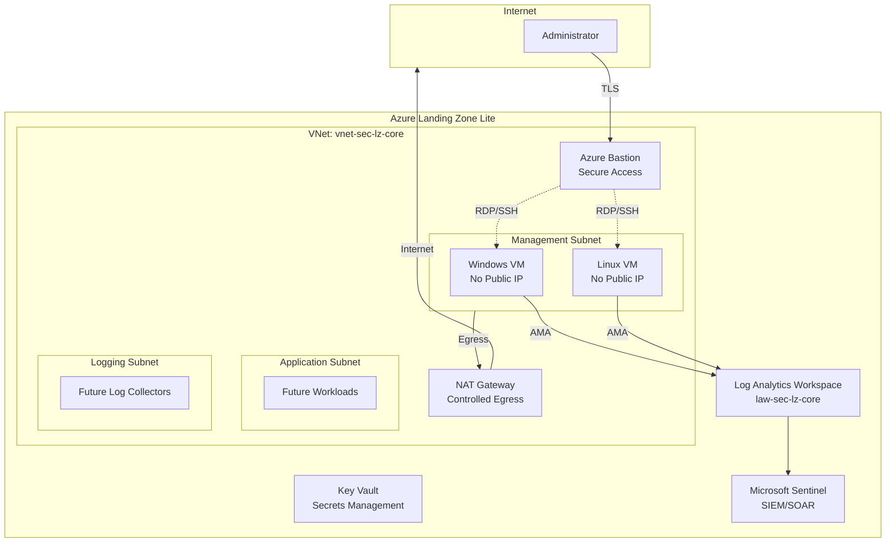
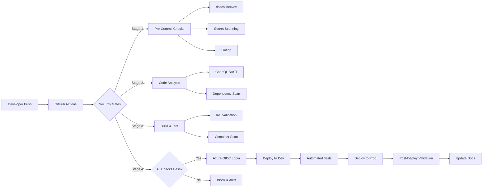

# 🛡️ Azure Cloud Security Portfolio

## Threat Detection • Cloud Security Engineering • DevSecOps


---

Hi! I'm **Clayton** — an early-career security professional focused on **Azure Cloud Security**, **DevSecOps automation**, and **cloud threat detection engineering**.

This portfolio showcases real, hands-on work across:

- Cloud security engineering  
- DevSecOps pipelines (secure CI/CD)  
- Cloud threat detection & KQL analytics  
- Infrastructure-as-Code (Bicep/Terraform)  
- Security automation & governance  

All projects are designed to run inside a **student Azure subscription**, making them reproducible and accessible.

> 📋 **Quick Links**: [Portfolio Index](PORTFOLIO-INDEX.md) | [Project A](projects/project-a-cloud-detection-lab/) | [Project B](projects/project-b-landing-zone-lite/) | [Architecture Docs](docs/architecture/)

---

## 📚 Navigation

- [🎯 Learning Objectives](#-learning-objectives)
- [🛠 Tech Stack](#-tech-stack)
- [⭐ Highlights](#-highlights)
- [📁 Project A – Cloud Threat Detection Lab](#-project-a--cloud-threat-detection-lab)
- [📁 Project B – Azure Landing Zone Lite](#-project-b--azure-landing-zone-lite-infrastructure-as-code)
- [📁 Project C – DevSecOps Pipelines](#-project-c--devsecops-pipelines)
- [📂 Repository Structure](#-repository-structure)
- [🚀 Getting Started](#-getting-started)
- [💰 Cost Management](#-cost-management)
- [📖 Additional Resources](#-additional-resources)
- [📫 Contact](#-contact)

---

## 🎯 Learning Objectives

This portfolio demonstrates proficiency in:

| Certification | Skills Demonstrated |
|--------------|-------------------|
| **AZ-500** (Azure Security Engineer) | Identity & access management, platform protection, security operations, data & application security |
| **SC-100** (Cybersecurity Architect) | Zero Trust architecture, security operations strategy, infrastructure security, compliance |
| **SC-200** (Security Operations Analyst) | Threat detection with KQL, incident response, threat hunting, Sentinel SIEM/SOAR |

**Additional Competencies:**
- Infrastructure-as-Code (Bicep/Terraform)
- CI/CD security automation
- MITRE ATT&CK framework
- Windows & Linux security hardening
- Cloud-native security tooling

---

## 🛠 Tech Stack

| Area | Technologies |
|------|--------------|
| ☁️ **Cloud** | Azure, Entra ID, Defender for Cloud, Log Analytics, Sentinel |
| 🏗 **IaC** | Bicep, Terraform, ARM Templates |
| 🔄 **DevSecOps** | GitHub Actions, OIDC, CodeQL, tfsec, Checkov, Trivy |
| 🖥 **Systems** | Windows Server, Ubuntu Linux, Sysmon, Azure Monitor Agent |
| 🔍 **Detection** | KQL, MITRE ATT&CK, Sigma Rules |
| 🔐 **Security** | NSGs, Azure Bastion, Key Vault, NAT Gateway, Zero Trust |
| 📊 **Monitoring** | Log Analytics Workspaces, Data Collection Rules, Flow Logs |

---

## ⭐ Highlights

- ✅ Built a full cloud threat detection lab using Sysmon + Log Analytics  
- ✅ Developed 20+ KQL detections mapped to MITRE ATT&CK
- ✅ Integrated AWS CloudTrail with Microsoft Sentinel for multi-cloud threat detection
- ✅ Built cross-cloud correlation joining AWS and Azure data on source IP
- ✅ Automated Slack incident notifications via Logic App SOAR playbook
- ✅ Created secure IaC deployments using Bicep & Terraform  
- ✅ Implemented DevSecOps pipelines with CodeQL, tfsec & Checkov  
- ✅ Automated Azure deployments using GitHub Actions + OIDC (no secrets!)  
- ✅ Architected a "Landing Zone Lite" blueprint for student subscriptions  
- ✅ Established centralized logging with AMA and Data Collection Rules
- ✅ Deployed Azure Bastion for secure, zero-trust administrative access

---

## 📁 Project A — Cloud Threat Detection Lab

**📂 Location:** [`/projects/project-a-cloud-detection-lab`](projects/project-a-cloud-detection-lab/)  
**📊 Status:** 🟩 Complete

A comprehensive cloud detection engineering environment featuring:

- **Defender for Endpoint**: 3 onboarded devices with 5 custom detection rules
- **Microsoft Sentinel**: 11+ analytics rules with MITRE ATT&CK mapping
- **SOAR Automation**: 6 Logic Apps playbooks for incident response
- **Threat Hunting**: 5 hypothesis-driven KQL hunting queries
- **Workbooks**: 4 operational dashboards for analysis and investigation
- **Azure Log Analytics**: Centralized log aggregation and analysis
- **Sysmon/AMA Integration**: Advanced telemetry collection

### 🎯 Security Operations Capabilities

**Detection & Response:**
- 11+ Sentinel analytics rules (credential access, privilege escalation, UEBA, AWS threat detection, cross-cloud correlation)
- 5 Defender for Endpoint custom detections (T1059, T1003, T1021, T1547, T1087)
- ASIM-based multi-source brute force detection
- Behavioral analytics with UEBA

**Automation & SOAR:**
- Automated incident containment (session revocation, account disable)
- High-severity email notifications
- Content Hub solution deployment

**Threat Hunting:**
- Off-hours administrative activity detection
- Rapid privilege escalation chain analysis
- Mass user modification detection
- Suspicious IP pattern identification
- Failed login spike analysis

### 📖 Documentation

| Document | Description | Status |
|----------|-------------|--------|
| [Lab 01 — RDP Brute Force Detection](projects/project-a-cloud-detection-lab/labs/lab-01-bruteforce-detection.md) | T1110 credential access detection and investigation | ✅ Complete |
| [Lab 02 — Suspicious Process Creation](projects/project-a-cloud-detection-lab/labs/lab-02-process-creation.md) | T1059.001 PowerShell execution analysis | ✅ Complete |
| [Lab 03 — AWS-Sentinel Multi-Cloud Detection](projects/project-a-cloud-detection-lab/labs/lab-03-aws-sentinel-integration.md) | AWS CloudTrail integration, 4 cross-cloud detection rules | ✅ Complete |
| [Defender for Endpoint](projects/project-a-cloud-detection-lab/defender-for-endpoint.md) | 3 devices, 5 custom detection rules | ✅ Complete |
| [Automation Playbooks](projects/project-a-cloud-detection-lab/automation-playbooks.md) | 6 Logic Apps SOAR workflows | ✅ Complete |
| [Playbook Case Studies](projects/project-a-cloud-detection-lab/playbooks/) | 3 detailed automation implementations | ✅ Complete |
| [Analytics Rules](projects/project-a-cloud-detection-lab/detections.md) | 11+ Sentinel detection rules | ✅ Complete |
| [Workbooks](projects/project-a-cloud-detection-lab/workbooks.md) | 4 investigation and hunting dashboards | ✅ Complete |
| [Threat Hunting Queries](projects/project-a-cloud-detection-lab/hunting-queries.md) | 5 hypothesis-driven hunts | ✅ Complete |

### 🏗 Architecture

View the complete architecture diagram and technical details:
- [Cloud Detection Lab Architecture](docs/architecture/ctd-lab-architecture.md)

### 🛠 Key Technologies

**Detection & Monitoring:**
- Microsoft Sentinel (SIEM/SOAR)
- AWS CloudTrail (via S3/SQS integration)
- Cross-cloud threat correlation (AWS + Azure)
- Defender for Cloud CSPM (multi-cloud posture)
- Defender for Endpoint (EDR)
- Windows Security Events (4624, 4625, 4688)
- Sysmon (Event IDs 1, 3, 7, 11)
- Azure Monitor Agent (AMA)
- UEBA (User & Entity Behavior Analytics)

**Automation & Response:**
- Logic Apps (SOAR workflows)
- Content Hub solutions
- Managed identities (secure authentication)

**Analysis & Hunting:**
- KQL (Kusto Query Language)
- Sentinel Workbooks
- ASIM normalization
- MITRE ATT&CK framework

### 📈 Skills Demonstrated

**Detection Engineering:**
- Cloud threat detection with Sentinel and Defender for Endpoint
- KQL query development and optimization
- Multi-cloud SIEM integration (AWS CloudTrail + Sentinel)
- Cross-cloud threat correlation using KQL joins
- CloudTrail JSON parsing and nested field extraction
- MITRE ATT&CK framework mapping
- Multi-source correlation with ASIM
- Behavioral analytics (UEBA) implementation

**Security Automation (SOAR):**
- Logic Apps workflow design and implementation
- Automated incident containment
- Content Hub solution deployment
- Managed identity configuration

**Threat Hunting:**
- Hypothesis-driven hunting methodology
- Risk scoring algorithm development
- Workbook development for operational efficiency
- Hunt-to-rule promotion workflows

**Investigation & Analysis:**
- Incident response and triage
- Attack simulation and validation
- Sysmon configuration and log analysis
- Cross-environment correlation

---

## 📁 Project B — Azure Landing Zone Lite (Infrastructure-as-Code)

**📂 Location:** [`/projects/project-b-landing-zone-lite`](projects/project-b-landing-zone-lite/)  
**📊 Status:** 🟩 Complete

A minimal, secure Azure Landing Zone designed for restricted tenants and student subscriptions.

### 🏗 Core Components

- **Network Segmentation**: VNet with isolated subnets (App, Mgmt, Logging)
- **Secure Access**: Azure Bastion for RDP/SSH (no public IPs on VMs)
- **Controlled Egress**: NAT Gateway for predictable outbound traffic
- **Identity Security**: Key Vault for secrets management
- **Monitoring**: Centralized logging with Log Analytics Workspace
- **Security**: Network Security Groups with least-privilege rules
- **Diagnostics**: Flow logs and Activity logs enabled

### 📚 Documentation

| Document | Description |
|----------|-------------|
| [Landing Zone Overview](projects/project-b-landing-zone-lite/landing-zone-lite.md) | Architecture overview and design principles |
| [Networking Deep Dive](projects/project-b-landing-zone-lite/networking.md) | Detailed networking configuration |
| [Troubleshooting Guide](projects/project-b-landing-zone-lite/troubleshooting.md) | Common issues and solutions |
| [Hybrid AD Setup](projects/project-b-landing-zone-lite/hybrid-ad-setup.md) | On-premises DC with Entra Connect | 
| [Architecture Diagram](docs/architecture/lzl-architecture.md) | Visual architecture documentation |

### 🔧 IaC Available In

- [`infra/bicep/`](infra/bicep/landing-zone-lite/) — 🟩 Core networking module completed
- [`infra/terraform/`](infra/terraform/) — Terraform alternative (planned)

### 🎨 Architecture Diagram (Mermaid)



### 🔐 Security Features

- ✅ Zero public IPs on VMs
- ✅ Azure Bastion for secure administrative access
- ✅ Network Security Groups with default-deny rules
- ✅ NAT Gateway for controlled outbound connectivity
- ✅ Flow logs enabled for network visibility
- ✅ Diagnostic settings on all key resources
- ✅ Centralized logging to Log Analytics
- ✅ Microsoft Sentinel for threat detection

### 📈 Skills Demonstrated

- Azure network design and segmentation
- Zero Trust security model implementation
- Infrastructure-as-Code development
- Secure VM deployment patterns
- Cloud architecture diagramming
- Azure Bastion configuration
- NAT Gateway implementation
- Log Analytics integration

---

## 📁 Project C — DevSecOps Pipelines

**📂 Location:** [`/projects/project-c-devsecops-pipelines`](projects/project-c-devsecops-pipelines/)  
**📊 Status:** 🟨 Planned

Secure CI/CD pipelines for automated infrastructure deployment and security validation.

### 🎯 Planned Features

**Security Scanning:**
- IaC linting and validation
- IaC security scanning (Checkov, tfsec)
- CodeQL static analysis
- Secret scanning
- Container image scanning (Trivy)
- Dependency vulnerability scanning

**Deployment Automation:**
- GitHub OIDC → Azure (no stored secrets)
- Automated Bicep/Terraform deployments
- Environment promotion workflows
- Rollback capabilities

**Governance & Compliance:**
- Policy-as-Code enforcement
- Drift detection
- Compliance reporting
- Automated documentation

### 📊 Pipeline Diagram (Planned)



### 🔮 Future Enhancements

- Automated Sentinel rule deployment
- Policy-as-Code with Azure Policy
- Workbook automation
- Logic App playbook deployment
- Defender for Cloud integration
- Compliance scanning and reporting

---

## 📂 Repository Structure

```text
azure-security-portfolio/
│
├─ README.md                          # This file
├─ PORTFOLIO-INDEX.md                 # Central project index
├─ LICENSE                            # MIT License
├─ .gitignore                         # Git ignore rules
│
├─ docs/                              # Documentation root
│   ├─ architecture/                  # Architecture diagrams & docs
│   │   ├─ ctd-lab-architecture.md    # Project A architecture
│   │   └─ lzl-architecture.md        # Project B architecture
│   └─ images/                        # Documentation images
│       ├─ cost-management.png
│       ├─ lab-01-brute-force-detection.png
│       ├─ lab-02-process-creation.png
│       └─ rg-sc200-lab-topology.png
│
├─ infra/                             # Infrastructure-as-Code
│   ├─ bicep/                         # Bicep modules (planned)
│   └─ terraform/                     # Terraform configs (planned)
│
├─ projects/                          # Project implementations
│   │
│   ├─ project-a-cloud-detection-lab/     # Project A
│   │   ├─ labs/                          # Lab case studies
│   │   │   ├─ lab-01-bruteforce-detection.md
│   │   │   └─ lab-02-process-creation.md
│   │   └─ detections.md                  # Detection pack
│   │
│   ├─ project-b-landing-zone-lite/       # Project B
│   │   ├─ images/                        # Project-specific images
│   │   │   └─ lz-lite-network.png
│   │   ├─ landing-zone-lite.md           # LZ overview
│   │   ├─ networking.md                  # Network details
│   │   └─ troubleshooting.md             # Common issues
│   │
│   └─ project-c-devsecops-pipelines/     # Project C (planned)
│       └─ (Coming soon)
│
└─ scripts/                           # Automation scripts
    ├─ install-ama.ps1                # AMA installation script
    └─ install-sysmon.ps1             # Sysmon installation script
```

---

## 🚀 Getting Started

### Prerequisites

**Azure Requirements:**
- Active Azure subscription (Student or Free Tier works)
- Owner or Contributor role on subscription
- Resource quota for VMs and networking

**Local Development:**
- Azure CLI installed
- PowerShell 7+ (for scripts)
- Git
- Text editor (VS Code recommended)

**Recommended Knowledge:**
- Basic Azure concepts (VMs, networking, storage)
- PowerShell fundamentals
- KQL basics (for detection work)

### Quick Start - Project A

1. **Clone the repository**
   ```bash
   git clone https://github.com/yourusername/azure-security-portfolio.git
   cd azure-security-portfolio
   ```

2. **Deploy base infrastructure**
   - Create a Resource Group: `rg-sc200-lab`
   - Deploy Windows VM
   - Create Log Analytics Workspace
   - Configure Azure Monitor Agent

3. **Install Sysmon (optional but recommended)**
   ```powershell
   .\scripts\install-sysmon.ps1
   ```

4. **Configure Data Collection Rules**
   - Windows Security Events
   - Sysmon Events (if installed)

5. **Enable Microsoft Sentinel**
   - Navigate to the Log Analytics Workspace
   - Enable Sentinel
   - Import analytics rules from detection pack

6. **Run test scenarios**
   - Follow lab guides in `projects/project-a-cloud-detection-lab/labs/`

### Quick Start - Project B

1. **Review architecture**
   - Read [landing-zone-lite.md](projects/project-b-landing-zone-lite/landing-zone-lite.md)
   - Review [networking.md](projects/project-b-landing-zone-lite/networking.md)

2. **Deploy components (manual for now, IaC coming)**
   - VNet with subnets
   - Azure Bastion
   - NAT Gateway
   - Management VMs
   - Log Analytics Workspace

3. **Configure monitoring**
   - Enable Flow Logs
   - Configure Data Collection Rules
   - Enable Sentinel

4. **Validate security posture**
   - Test Bastion connectivity
   - Verify NAT Gateway routing
   - Confirm log ingestion

---

## 💰 Cost Management

Running these labs in Azure incurs costs. Here are estimated monthly costs for a student subscription:

| Component | Estimated Cost (USD/month) | Notes |
|-----------|---------------------------|-------|
| Windows VM (B2s) | ~$30 | Can be deallocated when not in use |
| Linux VM (B2s) | ~$15 | Can be deallocated when not in use |
| Log Analytics (10GB/month) | ~$2.50 | First 5GB free per workspace |
| Sentinel | ~$0-5 | Based on ingestion volume |
| Azure Bastion (Basic) | ~$135 | Major cost driver |
| NAT Gateway | ~$35 | Includes data processing |
| Storage (Logs) | ~$1 | Minimal with retention limits |
| **Total (with Bastion)** | **~$220** | |
| **Total (without Bastion)** | **~$85** | Using NSG + JIT instead |

**💡 Cost Optimization Tips:**

1. **Deallocate VMs when not in use** (saves ~50% on compute)
   ```bash
   az vm deallocate --resource-group rg-sc200-lab --name vm-win-sc200-lab
   ```

2. **Use Azure Bastion Developer SKU** when available ($5/month vs $135/month)

3. **Limit Log Analytics retention** to 30 days for lab work

4. **Delete resources when lab is complete**
   ```bash
   az group delete --name rg-sc200-lab --yes --no-wait
   ```

5. **Use Azure Cost Management alerts** to monitor spending

6. **Consider Azure for Students** ($100 free credit)

> 📊 View actual costs: Check `docs/images/cost-management.png` for real-world spending example

---

## 📖 Additional Resources

### Official Microsoft Documentation
- [Microsoft Sentinel Documentation](https://learn.microsoft.com/en-us/azure/sentinel/)
- [Azure Security Best Practices](https://learn.microsoft.com/en-us/azure/security/fundamentals/best-practices-and-patterns)
- [KQL Quick Reference](https://learn.microsoft.com/en-us/azure/data-explorer/kql-quick-reference)
- [MITRE ATT&CK Framework](https://attack.mitre.org/)

### Learning Paths
- [AZ-500: Azure Security Engineer](https://learn.microsoft.com/en-us/certifications/exams/az-500)
- [SC-200: Security Operations Analyst](https://learn.microsoft.com/en-us/certifications/exams/sc-200)
- [SC-100: Cybersecurity Architect](https://learn.microsoft.com/en-us/certifications/exams/sc-100)

### Community Resources
- [Sysmon Config (SwiftOnSecurity)](https://github.com/SwiftOnSecurity/sysmon-config)
- [Sigma Rules](https://github.com/SigmaHQ/sigma)
- [LOLBAS Project](https://lolbas-project.github.io/)

---

## 📫 Contact

**Clayton Demps**

[](https://linkedin.com/in/claytondemps)

---

## 📜 License

This project is licensed under the MIT License - see the [LICENSE](LICENSE) file for details.

---

## 🙏 Acknowledgments

- Microsoft Learn for comprehensive Azure documentation
- MITRE ATT&CK team for threat framework
- SwiftOnSecurity for Sysmon configuration baseline
- Azure security community for shared knowledge

---

**⭐ If you find this portfolio helpful, please consider starring the repository!**

*Last Updated: December 2025*
