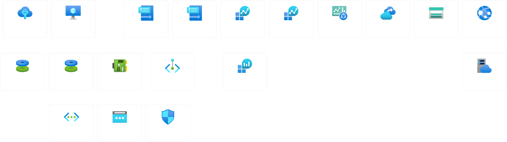

# Azure Security Portfolio – SC-200 + AZ-900

This portfolio showcases hands-on projects and labs completed while preparing for the **Microsoft Certified: Security Operations Analyst (SC-200)** and **Azure Fundamentals (AZ-900)** certifications.

Each section demonstrates applied skills across Microsoft Sentinel, Defender XDR, Defender for Cloud, Purview, and Azure core services.  
All work was built and validated within a live Azure tenant and documented using real data (redacted where necessary).

---

## Overview

| Certification | Focus Areas | Status |
|----------------|-------------|---------|
| **SC-200: Security Operations Analyst** | Sentinel, Defender XDR, Defender for Cloud, Purview | In Progress |
| **AZ-900: Azure Fundamentals** | Core Cloud Concepts, Architecture, Governance, Cost Mgmt | In Progress |

---

## Environment Overview

All resources are deployed under:
- **Resource Group:** `rg-sentinel-lab`
- **Region:** West US 2
- **Main VM:** `linux-lab-vm` (Ubuntu)
- **Monitoring Stack:** Azure Monitor Agent (AMA), Data Collection Rule (DCR), Log Analytics Workspace (LAW), Microsoft Sentinel, Defender for Cloud

---

## Resource Topology

---

## Repository Structure

| Folder | Description |
|--------|-------------|
| `/AZ-900/` | Azure Fundamentals labs and architecture exercises |
| `/SC-200/` | Microsoft Sentinel, Defender, and Purview security operations labs |
| `/trackers/` | Certification progress tracking CSVs |
| `/images/` | Diagrams, screenshots, KQL results |

---

## Technologies Used
**Azure Services:** Microsoft Sentinel, Log Analytics, Defender for Cloud, Purview, App Services, Azure Monitor  
**Security Focus:** Incident Detection, Threat Hunting, Automation Rules, SOC Monitoring  
**Languages/Tools:** KQL, Bash, PowerShell, Python, Azure CLI, ARM Templates  

---

## Key Learning Outcomes
- Configure Azure Monitor Agent and DCR for Linux Syslog ingestion  
- Integrate Microsoft Sentinel with Defender for Cloud  
- Develop and validate detection queries using KQL  
- Automate alert triage and response with Sentinel playbooks  

---

## Connect
**LinkedIn:** [linkedin.com/in/clayton-demps-19a894171](https://www.linkedin.com/in/clayton-demps-19a894171/) 
**GitHub:** [github.com/CMDemps](https://github.com/CMDemps)

**Created and maintained by Clayton Demps**  
*Aspiring Security Operations Analyst | Azure & Microsoft Security Enthusiast*
