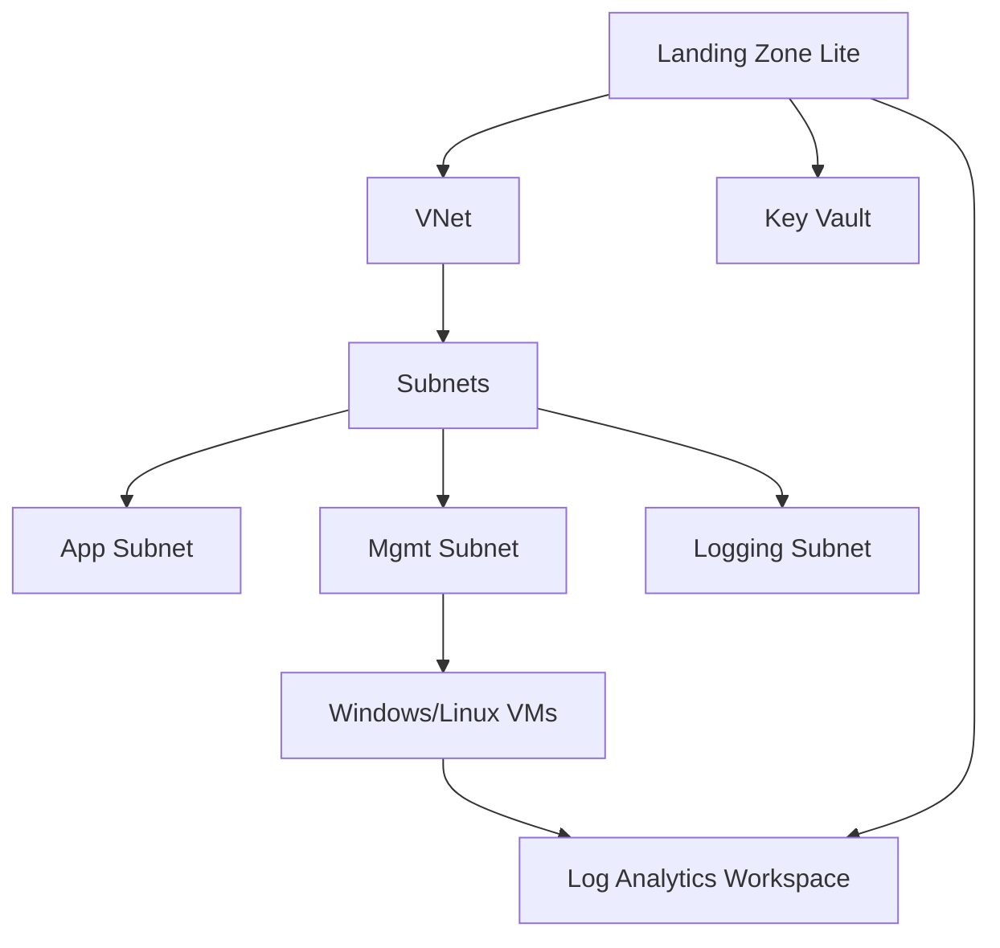
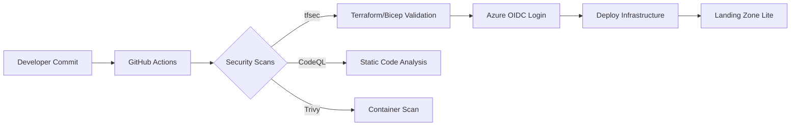

# 🛡️ Azure Cloud Security Portfolio

## DevSecOps • Cloud Security Engineering • Threat Detection


---

Hi! I'm **Clayton** — a security analyst focused on **Azure Cloud Security**, **DevSecOps automation**, and **cloud threat detection engineering**.

This portfolio showcases real, hands-on work across:

- Cloud security engineering  
- DevSecOps pipelines (secure CI/CD)  
- Cloud threat detection & KQL analytics  
- Infrastructure-as-Code (Bicep/Terraform)  
- Security automation & governance  

All projects are designed to run inside a **student Azure subscription**, making them reproducible and accessible.

---

## Navigation

- [📁 Project A – Cloud Threat Detection Lab](#-project-a--cloud-threat-detection-lab)  
- [📁 Project B – Azure Landing Zone Lite](#-project-b--azure-landing-zone-lite-infrastructure-as-code)  
- [📁 Project C – DevSecOps Pipelines](#-project-c--devsecops-pipelines)   
- [📁 Repository Structure](#-repository-structure)  

---

## Tech Stack

| Area | Technologies |
|------|--------------|
| ☁️ **Cloud** | Azure, Entra ID, Defender for Cloud, Log Analytics |
| 🏗 **IaC** | Bicep, Terraform, ARM |
| 🔄 **DevSecOps** | GitHub Actions, OIDC, CodeQL, tfsec, Checkov |
| 🖥 **Systems** | Windows, Linux, Sysmon, AMA |
| 🔍 **Detection** | KQL, MITRE ATT&CK |
| 🔐 **Security** | NSGs, Key Vault, Zero Trust concepts |

---

## Highlights

- Built a full cloud threat detection lab using Sysmon + Log Analytics  
- Developed 20+ KQL detections mapped to MITRE ATT&CK  
- Created secure IaC deployments using Bicep & Terraform  
- Implemented DevSecOps pipelines with CodeQL, tfsec & Checkov  
- Automated Azure deployments using GitHub Actions + OIDC (no secrets!)  
- Architected a "Landing Zone Lite" blueprint for student subscriptions  

---

## 📁 Project A — Cloud Threat Detection Lab

**Location:** `/detections` and `/docs`

A hands-on Advanced Cloud Detection Engineering environment featuring:

- Azure Log Analytics Workspace  
- Sysmon/AMA ingestion  
- KQL-based detections  
- MITRE ATT&CK-aligned threat scenarios  
- Full analysis writeups & graphs  

### Included Detection Scenarios

- Brute-force login attacks  
- Suspicious PowerShell/LOLBin usage  
- Process anomalies  
- Key Vault access anomalies  
- VM metadata exploitation patterns  
- Lateral movement techniques  

### Featured Case Studies

- **Lab 01 — Brute Force Detection**  
- **Lab 02 — Suspicious Process Trees (LOLBAS)**  
- `detections/detections.md` — Detection Pack  

### Architecture Diagram

- You can find the Cloud Detection lab architecture in `/docs/architecture/ctd-lab-architecture.md` to get the full picture  

---

## 📁 Project B — Azure Landing Zone Lite (Infrastructure-as-Code)

**Location:** `/infra`

A minimal, secure Azure Landing Zone designed for restricted tenants.

### Includes

- VNet + segmented subnets (App, Mgmt, Logging)  
- NSGs with least-privilege rules  
- Windows/Linux VMs  
- Key Vault  
- Diagnostic settings → LAW  
- Resource Group architecture  

### IaC Available In

- `/infra/bicep/` (Bicep modules)  
- `/infra/terraform/` (Terraform alternative)  

### Architecture Diagram (Mermaid)



---

## 📁 Project C — DevSecOps Pipelines

**Location:** `/pipelines`

Secure CI/CD pipelines for automated infrastructure deployment.

### Includes

- IaC linting & validation
- IaC security scanning (Checkov, tfsec)
- CodeQL static analysis
- Container image scanning
- Secure Azure login with GitHub OIDC
- Automated deploys of Bicep/Terraform
- (Planned) Policy-as-Code & drift detection

### Pipeline Diagram



---

## 📁 Repository Structure

Repository structure (expanded view):

```text
azure-security-portfolio/
├─ detections/
│   ├─ detections.md
│   └─ samples/
│
├─ docs/
│   ├─ architecture/
│   │   ├─ cloud-detection-architecture.md
│   │   └─ landing-zone-architecture.md
│   ├─ lab-01-bruteforce-detection.md
│   ├─ lab-02-process-anomaly.md
│   └─ images/
│       ├─ brute-force-diagram.png
│       ├─ detection-flow.png
│       ├─ landing-zone.png
│       └─ pipeline-architecture.png
│
├─ infra/
│   ├─ bicep/
│   ├─ terraform/
│   └─ docs/
│
├─ pipelines/
│   ├─ workflows/
│   └─ docs/
│
└─ PORTFOLIO-INDEX.md
```

</details>
