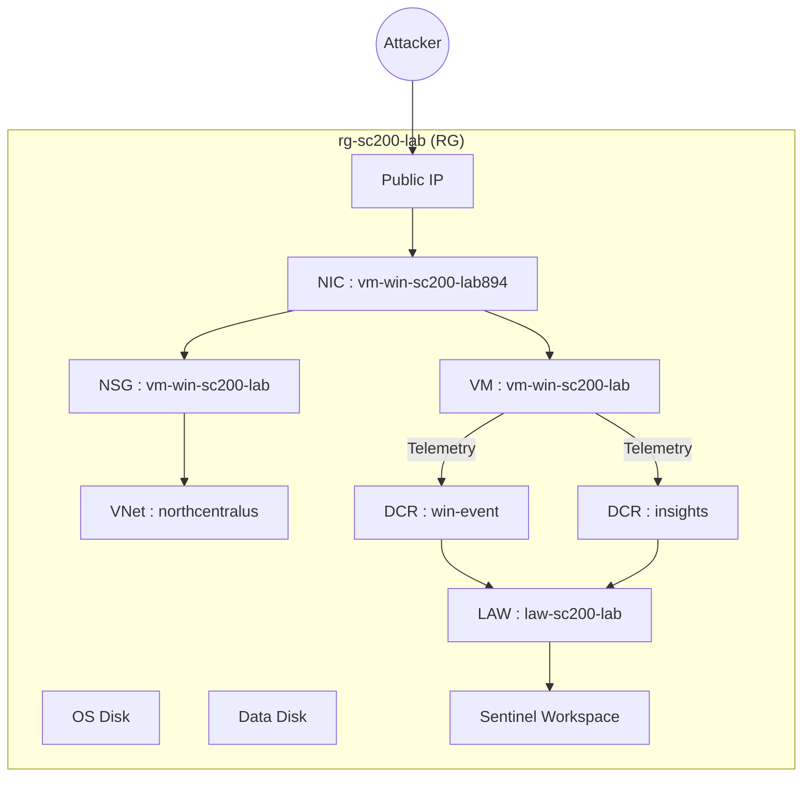

# 🛰 Cloud Detection Architecture — Project A: Cloud Threat Detection Lab

This document describes the architecture of my **Azure Cloud Threat Detection Lab**, focused on Windows endpoint telemetry, Sysmon, and Microsoft Sentinel analytics.

---

## 🎯 Goals

- Collect high-fidelity endpoint telemetry from an Azure Windows VM  
- Centralize logs in a Log Analytics Workspace  
- Use Microsoft Sentinel to detect and investigate attacks  
- Build and test custom analytics rules (e.g., RDP brute force, LOLBAS abuse)

---

## 🧱 Core Components

- **Resource Group**: Lab-scoped RG for all resources  
- **Windows VM** (`vm-win-sc200-lab`):  
  - Primary monitored endpoint  
  - Hosts attack simulations (RDP brute force, LOLBAS, etc.)
- **Disks** (`ssd-vm-sc200-lab-001`, OS disk):  
  - Standard Azure managed disks for OS and data
- **Network Interface** (`vm-win-sc200-lab894`):  
  - Attached NIC for the VM  
  - Bound to NSG and VNet
- **Virtual Network** (`vnet-northcentralus-sc200-lab`):  
  - Isolated lab network  
  - Optional subnets for future expansion (App, Mgmt, Logging)
- **Network Security Group** (`vm-win-sc200-lab-nsg`):  
  - Controls inbound RDP/SSH  
  - Can be tuned to model JIT access or Bastion-only access
- **Public IP** (`vm-win-sc200-lab-ip`):  
  - Current remote access entry point (good for RDP brute-force simulations)

### Logging & Analytics

- **Log Analytics Workspace** (`law-sc200-lab`):  
  - Central log store for:
    - `Event` / `WindowsEvent` (Windows Security + Sysmon via AMA)  
    - NSG Flow Logs (planned)  
    - Key Vault logs (planned)
- **Data Collection Rules**
  - `dcr-win-event-sc200-lab`:  
    - Collects Windows Security logs (4624, 4625, etc.) into `Event`/`WindowsEvent`
  - `MSVMI-northcentralus-vm-win-sc200-lab`:  
    - VM Insights / performance
- **Microsoft Sentinel Solution** (`SecurityInsights(law-sc200-lab)`):  
  - SIEM/SOAR layer on top of `law-sc200-lab`  
  - Hosts:
    - Analytics rules (e.g., RDP Brute Force, LOLBAS detection)  
    - Workbooks  
    - Hunting queries  
    - Incidents and investigations

---

## 🗺 Architecture Diagram (Logical)



## 🔍 Data Flow

**1. Attacker → VM**
   - RDP, PowerShell, LOLBAS execution, etc.
     
**2. VM → Log Collection**
   - AMA forwards Security + Sysmon logs based on DCRs.
     
**3. DCRs → Log Analytics**
   - Events normalized into ```Event``` / ```WindowsEvent``` tables.
     
**4. Sentinel → Detection & Investigation**
   - Analytics rules run on LAW data (e.g., RDP brute force, LOLBAS).
   - Alerts become incidents with mapped entities (Host, Account, Process).

## 🔧 Planned Enhancements

- Add NSG Flow Logs → LAW
- Add Key Vault + logs → LAW
- Create a Logic App playbook for automated response (e.g., email or IP block)
- Add a second VM as an internal “attacker box” for lateral movement labs

---
