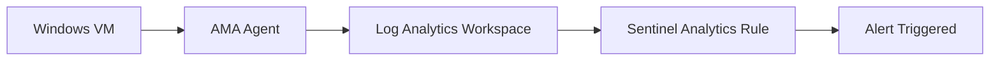

# 🧪 Lab 01 — Detecting RDP Brute Force Attacks in Azure  

## Cloud Threat Detection Case Study — Azure Security Portfolio

---

## Overview

This case study demonstrates how to detect and investigate a remote brute-force attack against an Azure Windows VM using:

- Azure Log Analytics Workspace  
- Azure Monitor Agent (AMA)  
- Windows Security Event Logs  
- A custom Microsoft Sentinel Analytics Rule  
- KQL threat detection  
- MITRE ATT&CK mapping  
- An investigation workflow and analysis

The goal is to simulate a realistic RDP brute-force attempt and validate that the detection triggers correctly.

---

## Lab Environment

| Component | Purpose |
|----------|---------|
| Windows VM (Azure) | Target for brute-force attempts |
| Log Analytics Workspace | Centralized log ingestion |
| AMA Agent | Sends Security logs to LAW |
| Sysmon (optional) | Provides enhanced process and network logs |
| Microsoft Sentinel | Analytics rule + alerting |

---

## Attack Scenario

### Goal  

Simulate repeated failed RDP authentication attempts under a short time window.

#### Why it matters  

Repeated failures may indicate:

- Credential stuffing  
- Password spraying  
- Targeted brute-force attacks  
- Misconfigured automated systems  

#### MITRE ATT&CK  

| Tactic | Technique | ID |
|--------|-----------|----|
| Credential Access | Brute Force | **T1110** |

---

## Simulation Steps

### Option A — Manual  

1. Attempt RDP login using an incorrect username.  
2. Attempt RDP login using an incorrect password.  
3. Repeat 10–20 times quickly.

### Option B — Automated (Kali)

```bash
hydra -l Administrator -P /usr/share/wordlists/rockyou.txt rdp://<TARGET-IP>
```

- RDP Attempts generate LogonType 10

---

## Log Ingestion

The following events were sent to Log Analytics:

### Windows Security Logs (via AMA)

- Event ID 4625 — Failed logon
  - Includes TargetUser, LogonType, Workstation, SourceIp via ParameterXml parsing

#### Sysmon (optional)

- Event ID 3 — Network connections
- Event ID 1 — Process creation

#### Flow



---

## Detection: Sentinel Analytics Rule

### RDP Brute Force Detection (Event Table)

This rule is actively enabled in Microsoft Sentinel.

**Severity**: High
**Technique**: MITRE T1110 (Brute Force)
**Runs**: Every 5 minutes
**Lookup period**: Last 5 minutes
**Trigger**: If query returns > 0 results

### KQL Analytics Rule Query (Actual Rule Implemented)

```kql
Event
| where EventLog == "Security"
| where EventID == 4625
| extend ParamList = extract_all(@'<Param>(.*?)</Param>', tostring(ParameterXml))
| extend 
    TargetUser = tostring(ParamList[5]),
    LogonType  = tostring(ParamList[10]),
    Workstation = tostring(ParamList[13]),
    SourceIp   = tostring(ParamList[18])
| where LogonType == "3" or LogonType == "10"
| where SourceIp != "0.0.0.0" and SourceIp != ""
| summarize FailedCount = count() by 
    SourceIp, 
    TargetUser, 
    Computer, 
    bin(TimeGenerated, 5m)
| where FailedCount >= 5
```

## What This Rule Detects

- High volume of failed login attempts
- Attempts targeting the same user
- Attempts from a single external IP
- RDP-specific attempts (LogonType 10)
- Network-based attempts (LogonType 3)
- Activity clustered within a 5-minute window

---

## Investigation Workflow

### 1. Identify attacker IP

```kql
Event
| where EventID == 4625
| summarize CountByIP = count() by SourceIp
| sort by CountByIP desc
```

### 2. Validate attack method

- ```LogonType = 10``` → RDP
- ```LogonType = 3``` → remote/network logon

### 3. Extract failure reasons

```kql
Event
| where EventID == 4625
| extend Reason = tostring(parse_xml(EventData).DataItem.EventData.Data[10].'#text')
| project TimeGenerated, TargetUser, SourceIp, Reason
```

### 4. Look for successful logon after failed attempts

```kql
Event
| where EventID == 4624
| where SourceIp == "<attacker-ip>"
```

### 5. Check Sysmon (optional)

Look for:

- Suspicious processes
- Unusual child processes
- Lateral movement behavior

---

## Results

During testing:

- 11 failed attempts occurred within 5 minutes
- Attempts originated from a single external IP
- ```LogonType 10``` confirmed RDP-based brute force
- No successful login followed the failures
- The analytics rule correctly triggered a High-severity alert

---

## Example Alert Summary

**Alert:** RDP Brute Force Detection (Event Table)
**Attacker IP:** X.X.X.X
**Target user:** Administrator
**Count:** 11
**Host:** Windows VM
**Severity:** High

---

## False Positive Considerations

- Users typing incorrect passwords
- Automated scripts reconnecting
- Misconfigured services
- IT testing credentials

### Reducing noise

- Exclude service accounts
- Exclude known IP ranges
- Raise threshold (e.g., >10)

---

## Mitigation Recommendations

- Restrict RDP via NSG or Azure Firewall
- Use Azure Bastion instead of public RDP
- Enable JIT Access (Defender for Cloud)
- Enforce strong password policies
- Block offending IPs
- Monitor for follow-up suspicious processes

---

## Skills Demonstrated

- KQL detection engineering
- Sentinel analytics rule creation
- MITRE ATT&CK mapping
- Cloud log ingestion using AMA
- Sysmon + Windows Event analysis
- Threat hunting & investigation workflow
- Azure VM security fundamentals
