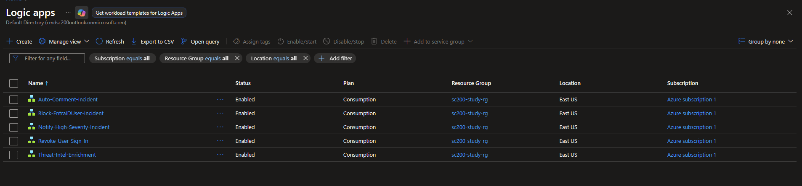
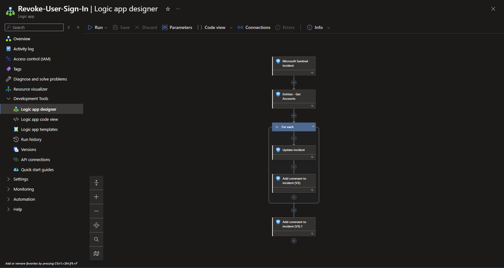
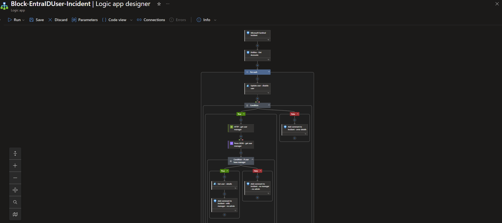
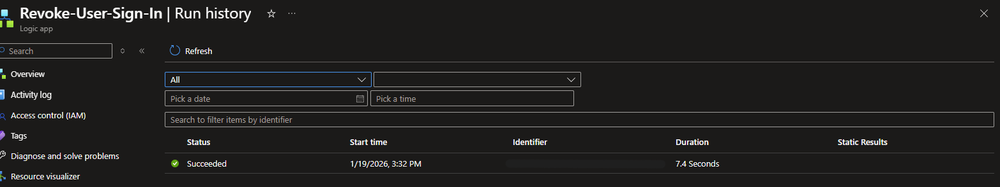

# 🤖 Security Automation Playbooks

## Overview
Developed 5 Logic App playbooks demonstrating Security Orchestration, Automation, and Response (SOAR) capabilities in Microsoft Sentinel. These playbooks automate incident response workflows, reducing mean time to respond (MTTR) and ensuring consistent security operations.

## Playbook Portfolio

| Playbook | Purpose | Trigger | Status |
|----------|---------|---------|--------|
| Auto-Comment-Incident | Adds automated triage comments to incidents | Manual/Automated | ✅ Operational |
| Revoke-User-Sign-In | Revokes compromised user sessions | Manual | ✅ Operational |
| Notify-High-Severity-Incident | Sends email alerts for critical incidents | Automated | ✅ Operational |
| Block-EntraIDUser-Incident | Disables compromised user accounts | Manual | ✅ Operational (Content Hub) |
| Threat-Intel-Enrichment | Auto-enriches incidents with TI data | Automated | ⚠️ Partial (API limitations) |

---

## Playbook 1: Auto-Comment-Incident

**Purpose:** Automatically adds standardized triage information to new incidents.

**Workflow:**
1. Trigger: Microsoft Sentinel incident created/updated
2. Extract incident details (title, severity, creation time)
3. Add structured comment with incident metadata
4. Tag incident for tracking

**Use Case:** Ensures every incident has consistent initial documentation, improving audit trail and analyst efficiency.

**Status:** ✅ Fully operational

---

## Playbook 2: Revoke-User-Sign-In (Containment)

**Purpose:** Immediately revokes user sign-in sessions for compromised accounts.

**Workflow:**
1. Trigger: Microsoft Sentinel incident (manual)
2. Extract account entities from incident
3. For each compromised account:
   - Revoke all active sign-in sessions (simulated for lab)
   - Add comment to incident documenting action
4. Tag incident as "ContainmentActive"

**Use Case:** Rapid containment of compromised user accounts while security team investigates.

**Status:** ✅ Fully operational

**Key Learning:** Revoke sessions is faster to implement than full account disable, provides immediate containment while preserving investigation data.

**Detailed Case Study:** See `/playbooks/playbook-01-revoke-user-signin.md`

---

## Playbook 3: Notify-High-Severity-Incident

**Purpose:** Sends email notifications to security team for High severity incidents.

**Workflow:**
1. Trigger: Microsoft Sentinel incident created
2. Check incident severity = High
3. Send email with:
   - Incident title and description
   - Severity and tactics
   - Direct link to incident
   - Affected entities (users, hosts, IPs)

**Use Case:** Ensures security team is immediately aware of critical threats requiring urgent attention.

**Status:** ✅ Fully operational

**Detailed Case Study:** See `/playbooks/playbook-02-high-severity-notification.md`

---

## Playbook 4: Block-EntraIDUser-Incident (Content Hub)

**Purpose:** Disables compromised Entra ID user accounts.

**Workflow:**
1. Trigger: Microsoft Sentinel incident (manual)
2. Extract account entities
3. Call Microsoft Graph API to disable accounts
4. Add comment documenting disabled accounts
5. Update incident status

**Use Case:** Complete account lockdown for confirmed compromises.

**Status:** ✅ Operational (deployed from Content Hub solution)

**Key Learning:** Content Hub provides production-ready playbooks with pre-configured Microsoft Graph API integration, saving significant development time.

**Detailed Case Study:** See `/playbooks/playbook-03-content-hub-block-user.md`

---

## Playbook 5: Threat-Intel-Enrichment

**Purpose:** Automatically enriches incidents with threat intelligence data for IP addresses.

**Workflow:**
1. Trigger: Microsoft Sentinel incident created
2. Extract IP entities from incident
3. Query threat intelligence API for each IP
4. Parse TI response (threat score, categories, last seen)
5. Add enrichment comment to incident

**Status:** ⚠️ Partial implementation

**Challenge:** Encountered API authentication and rate limiting issues during implementation. Query logic and workflow are functional, but external API integration requires additional configuration.

**Key Learning:** External API integrations require careful attention to authentication methods, rate limits, and error handling. In production, would use Microsoft Defender Threat Intelligence connector or VirusTotal API with proper authentication.

---

## Permissions Configuration

All playbooks use **Managed Identity** for authentication with:
- Microsoft Sentinel Responder role (add comments, update incidents)
- Microsoft Graph API permissions (user management for blocking/revoking - Content Hub playbook only)

**Security Best Practice:** No credentials stored in playbooks - all authentication via managed identity and Azure RBAC.

 - Shows successful playbook execution

---

## Deployment Approach

**Custom-built (3 playbooks):**
- Auto-Comment-Incident
- Revoke-User-Sign-In
- Notify-High-Severity-Incident

**Content Hub (1 playbook):**
- Block-EntraIDUser-Incident

**Partial/Learning (1 playbook):**
- Threat-Intel-Enrichment

**Key Insight:** Content Hub solutions accelerate deployment for common use cases, while custom playbooks provide flexibility for organization-specific workflows.

---

## Skills Demonstrated
- ✅ Logic App workflow design
- ✅ Microsoft Sentinel connector integration
- ✅ Entity extraction and processing
- ✅ For-each loops for multi-entity incidents
- ✅ Managed identity authentication
- ✅ Content Hub solution deployment
- ✅ SOAR best practices (tagging, commenting, status updates)
- ✅ Incident response automation
- ✅ Understanding of SOAR vs manual response tradeoffs
