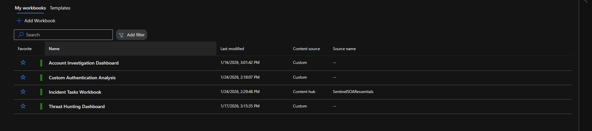

# 📊 Sentinel Workbooks

## Overview
Created 4 workbooks for different security operations use cases, demonstrating visualization, interactive analysis, and operational dashboarding capabilities in Microsoft Sentinel.

## Workbook Portfolio

| Workbook Name | Purpose | Status | Primary Use Case |
|---------------|---------|--------|------------------|
| Threat Hunting Dashboard | Execute saved hunting queries | ✅ Operational | Proactive threat hunting |
| Account Investigation Dashboard | Analyze user account activity | ⚠️ No data source | User behavior analysis |
| Custom Authentication Analysis | Interactive authentication analysis | ⚠️ No data source | Failed login investigation |
| Incident Tasks Workbook | Track incident response tasks | ✅ Operational | SOC workflow management |

---

## Workbook 1: Threat Hunting Dashboard

**Purpose:** Centralized dashboard for executing all 5 saved hunting queries with interactive time range filtering.

**Status:** ✅ Fully operational with data

### Features

**Interactive Parameters:**
- TimeRange picker (Last hour, 24 hours, 7 days, 30 days, custom)
- Dynamic query execution based on selected time window

**Hunting Queries Included:**
1. Off-Hours Administrative Activity
2. Rapid Privilege Escalation Chains
3. Mass User Modifications
4. Suspicious IP Patterns
5. Failed Login Spikes

### Design

**Layout:**
- Title section with timestamp
- TimeRange parameter control
- 5 query sections with individual visualizations
- Summary statistics

**Visualization Types:**
- Tables for detailed results
- Bar charts for count aggregations
- Time series for temporal patterns

### Use Case

**Proactive Threat Hunting Workflow:**
1. Analyst opens Threat Hunting Dashboard
2. Selects time range (typically last 24 hours)
3. Reviews all 5 hunt results in single view
4. Identifies anomalies requiring investigation
5. Promotes findings to incidents or analytics rules

**Time Saved:** Eliminates need to run 5 separate queries manually - results available in seconds.

### Key Learning

**TimeRange Parameter Implementation:**
- Requires manual parameter creation (not auto-generated)
- Parameter type: Time range picker
- Default value: Last 24 hours
- Usage in queries: `| where TimeGenerated {TimeRange}`

**This workbook demonstrates the most successful implementation** - queries return data consistently and parameter works as expected.

---

## Workbook 2: Account Investigation Dashboard

**Purpose:** Deep-dive analysis of specific user account activity for incident investigation.

**Status:** ⚠️ Queries return no data

### Intended Features

**Interactive Parameters:**
- UserPrincipalName input (select specific user)
- TimeRange picker

**Planned Query Sections:**
1. Recent authentication attempts (success/failure)
2. Role assignments and changes
3. Resource access patterns
4. Peer group comparison
5. Investigation priority score

### Issue Encountered

**Problem:** Queries designed for tables/data sources not actively ingesting data in lab environment.

**Likely causes:**
- Missing data connectors
- Insufficient log volume
- Query syntax referencing non-existent tables

**Resolution for production:** Would require:
- Entra ID data connector validation
- Office 365 connector for activity logs
- Azure Activity connector
- Longer data collection period (30+ days)

### Key Learning

**Workbooks require active data sources** - impressive visualizations mean nothing if underlying tables are empty. Always validate data availability before building complex workbooks.

---

## Workbook 3: Custom Authentication Analysis

**Purpose:** Interactive failed authentication analysis with device and user filtering.

**Status:** ⚠️ Queries return no data

### Intended Features

**Interactive Parameters:**
- DeviceName filter (analyze specific device)
- TimeRange picker

**Planned Visualizations:**
1. Failed login count by user
2. Failed login sources (IP addresses)
3. Failure details table
4. Time-based trend analysis

### Issue Encountered

**Problem:** Queries designed for `DeviceLogonEvents` table (Defender for Endpoint data source) but insufficient volume or missing data.

**Attempted Solutions:**
- Verified MDE devices onboarded (3 devices active)
- Checked Advanced Hunting for DeviceLogonEvents
- Confirmed query syntax correct

**Root cause:** Lab environment may not generate sufficient authentication events to populate this table, or delays in MDE data ingestion to Sentinel.

### Key Learning

**ASIM parsers vs native tables in workbooks:**
- Attempted to use ASIM `_Im_Authentication` parser
- Parsers query ALL possible sources (many don't exist in lab)
- Native tables (`DeviceLogonEvents`) more reliable for workbooks
- Design lesson: Use native tables when you control the data sources

---

## Workbook 4: Incident Tasks Workbook (Content Hub)

**Purpose:** Track and manage incident response tasks and workflow.

**Status:** ✅ Operational (deployed from Content Hub)

### Features

**Incident Task Tracking:**
- Active incidents list
- Task assignment status
- Response time metrics
- Incident aging indicators

### Deployment

**Source:** Microsoft Sentinel Content Hub solution  
**Installation:** One-click deployment from Content Hub  
**Customization:** Used as-is without modification

### Use Case

**SOC Workflow Management:**
- Provides unified view of all active incidents
- Tracks which analysts are assigned
- Shows incident age and SLA compliance
- Helps SOC managers identify resource bottlenecks

### Key Learning

**Content Hub accelerates workbook deployment:**
- Pre-built workbooks save 2-3 hours of development
- Production-tested queries and visualizations
- Microsoft maintains and updates
- Trade-off: Less customization, but faster deployment

**When to use Content Hub workbooks:**
- Common SOC use cases
- Time-constrained deployments
- Teams lacking visualization expertise
- Proven workflows preferred over custom design

---

## Workbook Design Principles Learned

### Successful Patterns

✅ **Parameter-driven interactivity** - TimeRange parameter in Threat Hunting Dashboard provides flexibility  
✅ **Multiple visualization types** - Tables for details, charts for trends  
✅ **Logical sectioning** - Group related queries together  
✅ **Native tables for reliability** - Use tables you know have data

### Challenges & Solutions

⚠️ **Empty query results:**
- **Problem:** Beautiful visualization, no data
- **Solution:** Always validate data source before building queries
- **Prevention:** Start with simple query, confirm results, then add visualizations

⚠️ **ASIM parser warnings in workbooks:**
- **Problem:** Parsers query tables that don't exist
- **Solution:** Use native tables specific to your data sources
- **Guidance:** ASIM best for analytics rules (future-proof), native tables best for workbooks (reliable)

⚠️ **Parameter complexity:**
- **Problem:** TimeRange parameter not auto-generated
- **Solution:** Manual parameter creation required
- **Reference:** Must use `{TimeRange}` syntax in queries

### Best Practices

**For production workbook development:**

1. **Data validation first** - Verify tables have data before building
2. **Start simple** - Basic query → Add parameters → Add visualizations
3. **Test incrementally** - Validate each section before moving on
4. **Use Content Hub** - Don't reinvent common use cases
5. **Native over ASIM** - For workbooks, use specific tables you control
6. **Document assumptions** - Note required data sources and connectors

---

## Production Workbook Recommendations

### High-Value Workbooks to Build

**1. Executive Security Dashboard**
- KPI metrics (active incidents, MTTR, coverage)
- Trend analysis (weekly/monthly)
- MITRE ATT&CK coverage heatmap

**2. SOC Analyst Dashboard**
- My assigned incidents
- Recent high-priority alerts
- Quick-reference hunting queries

**3. Compliance Reporting**
- Log ingestion health
- Data connector status
- Coverage gaps by data source

**4. Investigation Workbook**
- User activity deep-dive
- Host activity timeline
- IP reputation and geolocation

---

## Skills Demonstrated

- ✅ Workbook creation and design
- ✅ Interactive parameter configuration
- ✅ Multiple visualization types (tables, charts, grids)
- ✅ TimeRange parameter implementation
- ✅ Content Hub solution deployment
- ✅ Understanding data source requirements
- ✅ Troubleshooting empty query results
- ✅ ASIM parser vs native table decision-making
- ✅ Workbook design best practices
- ✅ Production workbook planning

---

## Lessons for SC-200 Exam

**Workbook exam concepts:**

**When to use workbooks:**
- Interactive analysis and investigation
- Executive reporting and KPIs
- Compliance and audit reporting
- Analyst productivity tools

**Workbook vs Analytics Rules:**
- Workbooks = On-demand analysis
- Analytics Rules = Automated detection

**Key features:**
- Parameters for interactivity
- Multiple visualization types
- Time-based filtering
- Export capabilities

**Common issues:**
- Missing data connectors
- Incorrect table references
- Parameter syntax errors
- Visualization limits (50K rows)
