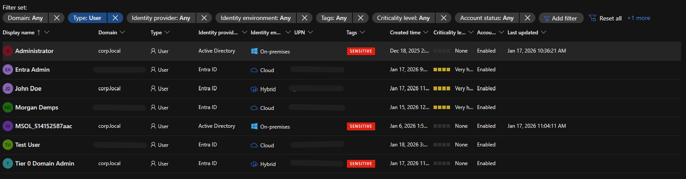

# 🔗 Hybrid Active Directory Setup

## Overview
Built hybrid Active Directory infrastructure connecting on-premises domain controller to Azure Entra ID, enabling realistic security scenarios for SC-200 certification preparation.

This hybrid setup allows testing detection rules across both on-premises (Windows Security Events, Defender for Identity) and cloud (Entra ID) data sources.



---

## Architecture

### On-Premises Environment

**Domain Controller:**
- **Hostname:** dc01.corp.local
- **OS:** Windows Server 2022
- **IP:** 10.10.0.10
- **Platform:** VMware Workstation
- **Domain:** corp.local (forest functional level 2016)
- **DNS:** Primary DNS server for corp.local zone

**Services Running:**
- Active Directory Domain Services
- DNS Server
- Entra Connect (Azure AD Connect)

### Azure Cloud Environment

**Entra ID Tenant:**
- **Domain:** [tenant].onmicrosoft.com
- **Sync Status:** Enabled
- **Sync Interval:** 30 minutes (default)
- **Sync Direction:** On-prem → Cloud (one-way)

---

## Deployment Process

### Phase 1: On-Premises Domain Controller Setup

**Step 1: VMware VM Deployment**
1. Created Windows Server 2022 VM
2. Configured static IP: 10.10.0.10/24
3. Set hostname: dc01
4. Installed VMware Tools

**Step 2: Active Directory Domain Services**
1. Installed AD DS role
2. Promoted to domain controller
3. Created new forest: corp.local
4. Configured DNS server

**Step 3: Test User and Computer Objects**
Created sample objects for testing:
- **Users:** 5 test accounts (jdoe, test user, t0 Admin, etc.)
- **Groups:** SG_Lab_Users, **Priveleged Group**, etc.
- **Computers:** ws01 (workstation object)

### Phase 2: Entra Connect Installation

**Step 1: Prerequisites**
- ✅ Domain Admin account (for on-prem AD)
- ✅ Global Administrator account (for Entra ID)
- ✅ Network connectivity from DC to Azure (outbound HTTPS)

**Step 2: Entra Connect Installation**
1. Downloaded Entra Connect from Microsoft
2. Ran installer on dc01.corp.local
3. Selected "Express Settings" for initial deployment
4. Provided credentials:
   - On-prem: corp\Administrator
   - Cloud: admin@[tenant].onmicrosoft.com

**Step 3: Configuration**
```
Sync Scope: All users and devices in corp.local
UPN Suffix: corp.local → [tenant].onmicrosoft.com
Password Sync: Enabled (Password Hash Synchronization)
Device Writeback: Disabled (not required for SC-200 labs)
```

**Step 4: Initial Sync**
- First sync completed: ~5 minutes
- Objects synced: 5 users, 1 computer, 3 groups

---

## Sync Configuration

### Sync Method: Password Hash Synchronization

**Why Password Hash Sync:**
- ✅ Simplest to configure
- ✅ No additional infrastructure (vs Federation or Pass-through Auth)
- ✅ Enables cloud authentication for testing
- ✅ Sufficient for SC-200 security detection scenarios

**Sync Scope:**
- **Organizational Units:** All OUs under corp.local
- **Object Types:** Users, groups, computers
- **Filtering:** None (sync all objects)

**Sync Schedule:**
- **Interval:** Every 30 minutes (default)
- **Manual sync:** `Start-ADSyncSyncCycle -PolicyType Delta` (PowerShell)

### Synced Attributes

**User objects sync:**
- UserPrincipalName → UPN in Entra ID
- sAMAccountName → mailNickname
- DisplayName → DisplayName
- Password hash (one-way hash for authentication)

**Computer objects sync:**
- Computer name
- Operating system version
- Last logon timestamp

---

## Testing and Validation

### Sync Validation

**Test 1: Create user on-prem, verify cloud sync**
1. Created user: testuser@corp.local on DC
2. Waited for sync cycle (~30 minutes)
3. Verified user appeared in Entra ID as testuser@[tenant].onmicrosoft.com
4. ✅ Result: User synced successfully

**Test 2: Password sync validation**
1. Set password for testuser on-prem
2. Waited for password hash sync
3. Attempted Entra ID sign-in with on-prem password
4. ✅ Result: Authentication successful (password hash working)

**Test 3: Computer object sync**
1. Domain-joined workstation ws01.corp.local
2. Verified computer object in on-prem AD
3. Checked Entra ID for synced device
4. ✅ Result: Device appeared in Entra ID devices list

**Screenshot:** `entra-connect-sync-status.png` shows successful sync status

---

## Integration with SC-200 Labs

### How Hybrid AD Supports Security Detection

**Use Case 1: Cross-Environment Correlation**
- Defender for Identity monitors on-prem DC (dc01.corp.local)
- Entra ID logs monitor cloud authentication
- Analytics rules correlate both data sources
- Example: Detect privilege escalation starting on-prem, moving to cloud

**Use Case 2: Realistic User Behavior**
- Synced users authenticate to both on-prem resources and Azure
- Failed sign-ins generate events in both environments
- UEBA analyzes behavior across hybrid environment

**Use Case 3: Lateral Movement Detection**
- User authenticated on-prem (Windows Security Events)
- Same user accesses Azure resources (Entra ID logs)
- Timeline shows complete attack chain

### Data Sources Enabled by Hybrid Setup

**On-Premises:**
- Windows Security Events (from DC via Azure Monitor Agent)
- Defender for Identity events (dc01.corp.local monitored)
- DNS query logs

**Cloud:**
- Entra ID sign-in logs (for synced users)
- Entra ID audit logs (sync operations, role changes)
- UEBA behavioral analytics (hybrid user context)

---

## Security Monitoring of Sync Infrastructure

### Entra Connect Monitoring

**Key events to monitor:**
- Sync failures (object sync errors)
- Password sync failures
- Unauthorized changes to sync configuration
- Privilege escalation via Entra Connect account

**Analytics rule example:**
```kql
AuditLogs
| where OperationName contains "Azure AD Connect"
| where Result == "failure"
| project TimeGenerated, OperationName, Result, Identity, TargetResources
```

### Security Considerations

**Entra Connect Security:**
- 🔒 Runs as domain admin on-prem (high privilege)
- 🔒 Global admin equivalent in cloud
- 🔒 Protect DC hosting Entra Connect with MFA, restricted access
- 🔒 Monitor for unauthorized sync configuration changes

**Best practices implemented:**
- DC restricted to admin-only access
- Entra Connect account not used for interactive login
- Regular review of sync errors (may indicate attack attempts)
- MFA enabled for all Admin accounts

---

## Troubleshooting Experience

### Issue 1: Initial Sync Failures

**Problem:** First sync attempt failed with "connectivity error"

**Root cause:** VMware firewall blocking outbound HTTPS

**Solution:**
1. Verified network connectivity: `Test-NetConnection login.microsoftonline.com -Port 443`
2. Configured VMware NAT to allow outbound HTTPS
3. Re-ran sync: `Start-ADSyncSyncCycle -PolicyType Initial`

**Lesson:** Always validate Azure connectivity before troubleshooting Entra Connect configuration

### Issue 2: User UPN Mismatch

**Problem:** Synced users had UPN format username@corp.local instead of username@[tenant].onmicrosoft.com

**Root cause:** Default UPN suffix in on-prem AD didn't match cloud-routable domain

**Solution:**
1. Added alternate UPN suffix in on-prem AD: [tenant].onmicrosoft.com
2. Updated test user UPNs to use cloud-routable suffix
3. Forced delta sync
4. Users now properly formatted for cloud authentication

**Lesson:** UPN planning critical for hybrid environments - must use internet-routable domain suffix

---

## Skills Demonstrated

- ✅ Windows Server 2022 deployment and configuration
- ✅ Active Directory Domain Services installation and promotion
- ✅ VMware virtual infrastructure management
- ✅ Entra Connect (Azure AD Connect) installation and configuration
- ✅ Password Hash Synchronization setup
- ✅ Hybrid identity architecture design
- ✅ Sync troubleshooting and validation
- ✅ Cross-environment security monitoring
- ✅ Understanding hybrid authentication flows

---

## Key Learnings

### Hybrid Identity Insights

**Password Hash Sync Benefits:**
- Simplest authentication method
- No additional infrastructure required
- Enables cloud authentication even if on-prem DC offline
- One-way hash (cloud can't reverse to plaintext)

**Sync Timing:**
- 30-minute default interval (can be reduced to 30 seconds minimum)
- Immediate sync available via PowerShell (`Start-ADSyncSyncCycle`)
- Initial sync slower than delta syncs

**Object Lifecycle:**
- Creating on-prem object triggers cloud creation
- Deleting on-prem object soft-deletes in cloud (30-day retention)
- Modified attributes sync within next cycle

### Security Detection Value

**Hybrid environment provides:**
- Complete attack timeline (on-prem initial access → cloud lateral movement)
- Richer UEBA context (user behavior across both environments)
- More detection data sources than cloud-only setup

**Trade-off:**
- Increased complexity (two environments to secure and monitor)
- More potential attack surface (Entra Connect is high-value target)

---

## Production Recommendations

### Entra Connect Hardening

**For production deployments:**

1. **Dedicated server** - Don't install on domain controller
2. **Staging mode** - Deploy second Entra Connect server in standby
3. **Monitoring** - Alert on sync failures and configuration changes
4. **Backup** - Export Entra Connect configuration regularly

### Sync Governance

**Filtering and scoping:**
- Don't sync all OUs (use OU filtering)
- Exclude test/service accounts
- Implement attribute filtering for sensitive data
- Use group-based sync filtering

---

## Impact on SC-200 Preparation

**How hybrid AD enhanced learning:**

✅ **Realistic scenarios** - Attacks rarely stay in single environment  
✅ **Cross-source correlation** - Analytics rules query both on-prem and cloud data  
✅ **Defender for Identity** - Requires on-prem DC to monitor  
✅ **Advanced detections** - Golden ticket attacks, DCSync, etc. require hybrid setup  
✅ **UEBA richness** - More behavioral data for anomaly detection

**Without hybrid setup, would miss:**
- Defender for Identity capabilities
- Cross-environment attack chains
- On-prem → cloud privilege escalation scenarios
- Complete lateral movement detection

---

## Architecture Diagram
```
┌─────────────────────────────────────┐
│   On-Premises (VMware)              │
│                                     │
│   ┌──────────────────────┐          │
│   │  dc01.corp.local     │          │
│   │  (Windows Server 22) │          │
│   │                      │          │
│   │  - AD Domain Services│          │
│   │  - DNS Server        │          │
│   │  - Entra Connect     │          │
│   │  - Test Users (5)    │          │
│   └──────────┬───────────┘          │
│              │                      │
└──────────────┼──────────────────────┘
               │
               │ HTTPS (Sync)
               │ Password Hash Sync
               │ Every 30 minutes
               │
               ▼
┌──────────────────────────────────────┐
│   Azure Cloud                        │
│                                      │
│   ┌────────────────────────┐         │
│   │  Entra ID Tenant       │         │
│   │                        │         │
│   │  - Synced Users (5)    │         │
│   │  - Synced Devices (1)  │         │
│   │  - Synced Groups (3)   │         │
│   │                        │         │
│   │  Authentication for    │         │
│   │  Azure resources       │         │
│   └────────────────────────┘         │
│                                      │
│   ┌────────────────────────┐         │
│   │  Microsoft Sentinel    │         │
│   │                        │         │
│   │  Data Sources:         │         │
│   │  - Entra ID Logs       │         │
│   │  - Windows Events (DC) │         │
│   │  - Defender for ID     │         │
│   └────────────────────────┘         │
│                                      │
└──────────────────────────────────────┘
```

**Key:** Hybrid setup enables complete visibility across on-premises and cloud environments for comprehensive security operations training.
